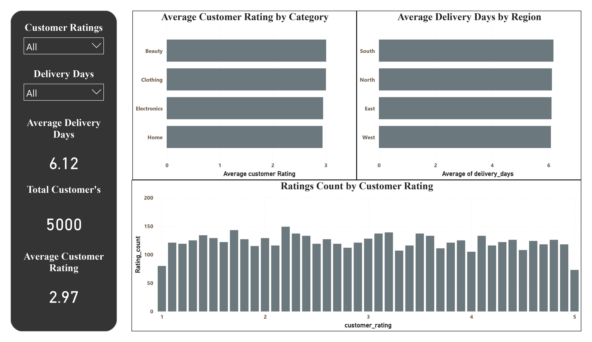

# E-Commerce Sales Analysis & Power BI Dashboard

## 📊 Project Overview

This project focuses on analyzing e-commerce sales data to identify sales trends, customer behavior, product performance, delivery performance, ratings, and discount patterns.

The project follows an end-to-end data analytics workflow:

## 💼 Business Problem

An e-commerce business generates a large amount of data related to orders, products, sales, discounts, customer ratings, and delivery performance. However, raw data alone does not provide clear insights for making business decisions.

The business needs to understand:

* Which product categories generate the most sales?
* How are sales changing over time?
* Which products or categories perform well?
* How are customers rating their purchases?
* Does delivery time have an impact on customer ratings?
* How are discounts distributed across products and categories?
* Are higher discounts associated with changes in sales or customer ratings?
* What areas require attention to improve overall business performance?

### 🎯 Business Objective

The objective of this project is to **clean and analyze e-commerce data and develop an interactive Power BI dashboard** that helps stakeholders monitor key performance indicators, identify trends and patterns, and gain actionable insights into sales, customer ratings, delivery performance, and discount strategies.

The dashboard provides a centralized view of the data, allowing users to interact with different categories, time periods, and metrics to support data-driven business decisions.

**Data Cleaning → Data Analysis → Data Visualization → Power BI Dashboard → Business Insights**

## 🛠️ Tools & Technologies

* **Power BI** – Dashboard development and visualization
* **Power Query** – Data cleaning and transformation
* **DAX** – KPI and analytical measures
* **Excel / CSV** – Dataset and data preparation

## 📌 Key Analysis Areas

### 1. Sales Analysis

* Total sales
* Sales by product category
* Sales trends over time
* Product performance
* Category contribution

### 2. Customer Analysis

* Customer rating distribution
* Customer behavior
* Rating by product/category

### 3. Delivery Analysis

* Delivery time analysis
* Delivery time vs. customer rating
* Delivery performance across categories

### 4. Discount Analysis

* Discount percentage
* Discount vs. sales/price
* Product categories with higher discounts
* Relationship between discounts and customer ratings

## 📈 Power BI Dashboard

The dashboard provides interactive visualizations using:

* KPI Cards
* Bar Charts
* Line Charts
* Donut/Pie Charts
* Scatter Plots
* Tables
* Slicers and Filters

Users can interact with the dashboard to explore sales, products, ratings, discounts, and delivery performance.

## 🔍 Key Insights

The analysis was used to identify:

* High-performing product categories
* Sales trends over time
* Customer rating patterns
* Delivery performance patterns
* Discount distribution
* Relationships between delivery time and customer ratings

## 🎯 Objective

The main objective of this project is to transform raw e-commerce data into meaningful insights through data cleaning, analysis, and interactive Power BI visualization.

## 👤 Skills Demonstrated

**Data Cleaning • Data Analysis • Power BI • Power Query • DAX • Data Visualization • EDA • Business Insights**

## 📸 Dashboard Preview

### Page 1 — Executive Sales Overview

### Page 2 — Product & Sales Analysis

### Page 3 — Customer & Satisfaction Analysis

### Page 4 — Discount & Delivery Analysis

